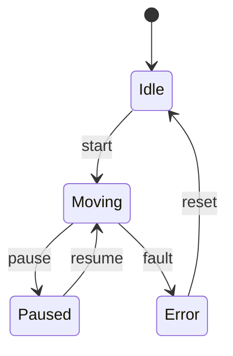

# Complete FSM Toolkit

A comprehensive suite of tools for working with Finite State Machines in your codebase.

## 🎯 What This Gives You

Two complementary tools that work together:

1. **code-to-fsm**: Extract state machines from existing code using AI
2. **mermaid-to-xstate**: Convert Mermaid diagrams to executable XState code

Together, they enable a complete workflow from messy implicit state logic to clean, debuggable state machines.

## 🚀 Quick Start

### Platform Support

**✅ Fully Cross-Platform:**
- Windows 10/11
- macOS (Intel & Apple Silicon)
- Linux (Ubuntu, Debian, Fedora, etc.)

**Requirements:** Node.js 14+ and npm

### Automated Setup

**macOS / Linux:**
```bash
./quickstart.sh
```

**Windows (PowerShell):**
```powershell
.\quickstart.ps1
```

**Windows (Command Prompt):**
```cmd
quickstart.bat
```

### Manual Setup & Extract State Machine from Your Code

**macOS / Linux:**
```bash
cd code-to-fsm
npm install
node cli.js analyze /path/to/your/robot/project --to-xstate
```

**Windows:**
```cmd
cd code-to-fsm
npm install
node cli.js analyze C:\path\to\your\robot\project --to-xstate
```

This will:
1. ✅ Analyze your code with Claude AI
2. ✅ Generate a Mermaid state diagram
3. ✅ Convert to XState machine code
4. ✅ Save everything in `./fsm-output/`

### Convert Mermaid to XState

```bash
cd mermaid-to-xstate
npm install
node cli.js input.mmd -o output.js
```

## 📦 What's Included

```
├── code-to-fsm/           # AI-powered code analysis
│   ├── cli.js             # Command-line interface
│   ├── analyzer.js        # Core analyzer with Claude integration
│   ├── example-robot/     # Example Python robot controller
│   ├── README.md          # Detailed documentation
│   └── WORKFLOW_GUIDE.md  # Complete step-by-step guide
│
└── mermaid-to-xstate/     # Mermaid → XState converter
    ├── cli.js             # Command-line interface
    ├── parser.js          # Mermaid parser
    ├── visualizer.html    # Interactive state machine tester
    ├── example.mmd        # Example Mermaid diagram
    └── README.md          # Detailed documentation
```

## 🎓 The Complete Workflow

### Problem: Your Code Has Implicit State

```python
# Messy implicit state
class Robot:
    def __init__(self):
        self.is_moving = False
        self.is_paused = False
        self.has_error = False
        # What if all three are True? 🤔
```

### Solution: Extract → Visualize → Refactor

**Step 1: Extract the state machine**
```bash
cd code-to-fsm
node cli.js analyze ../my-robot-project
```

**Step 2: Get a beautiful Mermaid diagram**


**Step 3: Convert to executable XState**
```bash
cd ../mermaid-to-xstate
node cli.js ../fsm-output/state-machine.mmd -o robot-machine.js
```

**Step 4: Refactor your code**
```javascript
import { interpret } from 'xstate';
import robotMachine from './robot-machine.js';

const service = interpret(robotMachine).start();
service.send('START');  // Clear, explicit state transitions
```

**Step 5: Debug visually**
```javascript
// Open XState Inspector
service.state.value;  // "Moving"
service.state.can('PAUSE');  // true
```

## 🌟 Key Features

### code-to-fsm

- ✅ **AI-Powered Analysis**: Uses Claude to understand your code
- ✅ **Multi-Language Support**: Python, JavaScript, TypeScript, C++, Java, etc.
- ✅ **Interactive Mode**: Chat with Claude about your state machine
- ✅ **Automatic Documentation**: Generates diagrams for your docs

### mermaid-to-xstate

- ✅ **Clean Conversion**: Mermaid diagrams → XState code
- ✅ **Multiple Formats**: ESM, CommonJS, or JSON output
- ✅ **Interactive Visualizer**: Test your state machine in the browser
- ✅ **Production Ready**: Generate code you can actually use

## 📖 Documentation

- [code-to-fsm README](./code-to-fsm/README.md) - Full analyzer documentation
- [mermaid-to-xstate README](./mermaid-to-xstate/README.md) - Full converter documentation
- [WORKFLOW_GUIDE.md](./code-to-fsm/WORKFLOW_GUIDE.md) - Complete step-by-step guide
- [PLATFORM_COMPATIBILITY.md](./PLATFORM_COMPATIBILITY.md) - **Cross-platform setup & troubleshooting**

## 🎯 Use Cases

### 1. Understanding Legacy Code
```bash
# Inherited a robot project with unclear state logic?
cd code-to-fsm
node cli.js analyze ./legacy-robot --focus "main controller"
```

### 2. Refactoring to Clean State Machines
```bash
# Extract implicit state machine
cd code-to-fsm
node cli.js analyze ./my-project --to-xstate

# Refactor code to use the generated XState machine
# Enjoy clearer, more maintainable code!
```

### 3. Documentation
```bash
# Generate state diagrams for your documentation
cd code-to-fsm
node cli.js analyze ./src -o ./docs/state-machines
```

### 4. Design-First Workflow
```bash
# Design your state machine in Mermaid first
code state-machine.mmd

# Convert to XState
cd mermaid-to-xstate
node cli.js state-machine.mmd -o machine.js

# Implement your features using the state machine
```

## 🔧 Requirements

- Node.js 14+
- npm or yarn
- For code-to-fsm: Access to Claude API (works in artifacts environment)

### Platform-Specific Notes

**Windows:**
- Use PowerShell or Command Prompt (both work!)
- File paths use backslashes: `C:\Users\...\project`
- npm commands work identically to Unix systems

**macOS:**
- No additional setup needed
- Works on both Intel and Apple Silicon

**Linux:**
- Install Node.js via package manager or nvm
- Works on all major distributions

## 🚀 Installation

### Install Both Tools

```bash
# Install code-to-fsm
cd code-to-fsm
npm install
npm link  # Optional: install globally

# Install mermaid-to-xstate
cd ../mermaid-to-xstate
npm install
npm link  # Optional: install globally
```

### Global Usage (after npm link)

```bash
code-to-fsm analyze /my/project --to-xstate
mermaid-to-xstate diagram.mmd -o machine.js
```

## 💡 Examples

See these files for complete examples:

- `code-to-fsm/example-robot/` - Sample Python robot controller
- `code-to-fsm/EXAMPLE_OUTPUT.txt` - What the analyzer produces
- `mermaid-to-xstate/example.mmd` - Sample Mermaid diagram
- `mermaid-to-xstate/complex-example.mmd` - Complex authentication flow

## 🤝 Integration

### With Claude Code

This toolkit is designed to work seamlessly with Claude Code:

1. Use Claude Code to understand and refactor your codebase
2. Run `code-to-fsm` to extract state machines
3. Use the generated diagrams and XState code
4. Continue refactoring with Claude Code's help

### With CI/CD

```yaml
# Generate state machine documentation on every commit
- name: Generate FSM Diagrams
  run: |
    cd code-to-fsm
    npm install
    node cli.js analyze ../src -o ../docs/fsm
```

### With XState Inspector

All generated XState machines work with the official XState Inspector for visual debugging:

```javascript
import { inspect } from '@xstate/inspect';

inspect({ iframe: false });
const service = interpret(machine, { devTools: true });
```

Visit https://stately.ai/viz to debug visually!

## 🎓 Learning Resources

- [XState Documentation](https://xstate.js.org)
- [Mermaid Documentation](https://mermaid.js.org)
- [State Machines Intro](https://xstate.js.org/docs/guides/introduction-to-state-machines-and-statecharts/)
- [Stately Inspector](https://stately.ai/viz)

## 🐛 Troubleshooting

### code-to-fsm issues

**"No files found"**
- Use `-f` flag to specify files explicitly
- Check your file patterns with `-p` flag

**"Claude API error"**
- Make sure you're running in an environment with Claude API access
- The tool works best in the artifacts environment

### mermaid-to-xstate issues

**Invalid Mermaid syntax**
- Check your diagram syntax at https://mermaid.live
- Only `stateDiagram-v2` is supported

## 🔮 Future Enhancements

- [ ] Support for hierarchical/nested states
- [ ] Extract guards and actions from code comments
- [ ] Detect state machine bugs (deadlocks, unreachable states)
- [ ] Generate test cases from state machines
- [ ] Web UI for the complete workflow
- [ ] VS Code extension
- [ ] Support for more state machine formats (Harel charts, etc.)

## 📝 License

MIT

## 🙏 Credits

Built with:
- [XState](https://xstate.js.org) - State machine library
- [Mermaid](https://mermaid.js.org) - Diagram syntax
- [Claude](https://claude.ai) - AI-powered code analysis
- [Commander.js](https://github.com/tj/commander.js) - CLI framework

---

**Ready to untangle your state logic? Start with:**

```bash
cd code-to-fsm
node cli.js analyze /your/robot/project
```

Happy state machine engineering! 🎉
