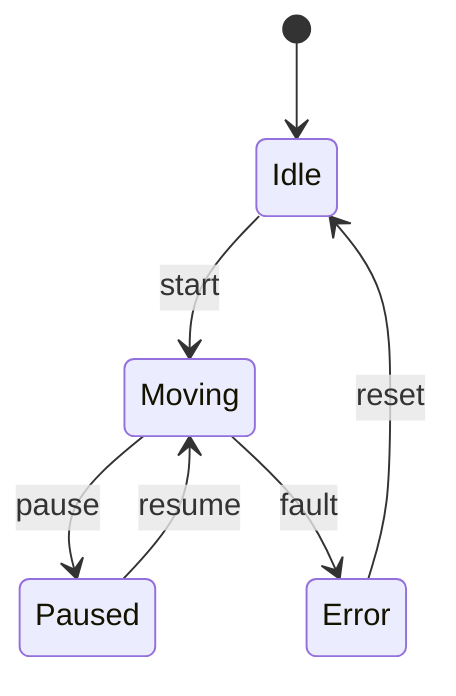

# Robot FSM Generator

Extract state machines from your robot codebase and generate beautiful Mermaid diagrams using AI.

## 🎯 What This Gives You

**code-to-fsm**: An AI-powered tool that analyzes your code and automatically generates beautiful Mermaid state diagrams, making implicit state machines visible and understandable.

## 🚀 Quick Start

### Platform Support

**✅ Fully Cross-Platform:**
- Windows 10/11
- macOS (Intel & Apple Silicon)
- Linux (Ubuntu, Debian, Fedora, etc.)

**Requirements:** Python 3.7+ and Claude Code CLI

### Automated Setup

**All Platforms:**
```bash
python quickstart.py
```

Or on Windows:
```cmd
python quickstart.py
```

### Manual Setup & Extract State Machine from Your Code

**macOS / Linux:**
```bash
cd code-to-fsm
python3 cli.py analyze /path/to/your/robot/project
```

**Windows:**
```cmd
cd code-to-fsm
python cli.py analyze C:\path\to\your\robot\project
```

This will:
1. ✅ Analyze your code with Claude AI
2. ✅ Generate a Mermaid state diagram
3. ✅ Open interactive visualization in browser
4. ✅ Save everything in `./fsm-output/`

## 📦 What's Included

```
code-to-fsm/              # AI-powered code analysis
├── cli.js                # Command-line interface
├── analyzer.js           # Core analyzer with Claude integration
├── example-robot/        # Example Python robot controller
├── README.md             # Detailed documentation
└── WORKFLOW_GUIDE.md     # Complete step-by-step guide
```

## 🎓 The Workflow

### Problem: Your Code Has Implicit State

```python
# Messy implicit state
class Robot:
    def __init__(self):
        self.is_moving = False
        self.is_paused = False
        self.has_error = False
        # What if all three are True? 🤔
```

### Solution: Extract → Visualize → Document

**Step 1: Extract the state machine**
```bash
cd code-to-fsm
node cli.js analyze ../my-robot-project
```

**Step 2: Get a beautiful Mermaid diagram**


**Step 3: View interactively in browser**
The tool automatically opens an interactive HTML viewer where you can:
- View the diagram with zoom and pan
- Export as SVG or PNG
- Share with your team

## 🌟 Key Features

- ✅ **AI-Powered Analysis**: Uses Claude to understand your code
- ✅ **Multi-Language Support**: Python, JavaScript, TypeScript, C++, Java, etc.
- ✅ **Interactive Mode**: Chat with Claude about your state machine
- ✅ **Beautiful Mermaid Diagrams**: Professional state diagrams for documentation
- ✅ **Interactive Viewer**: Zoom, pan, and export diagrams in browser
- ✅ **Automatic Documentation**: Generates diagrams ready for your docs

## 📖 Documentation

- [code-to-fsm README](./code-to-fsm/README.md) - Full analyzer documentation
- [WORKFLOW_GUIDE.md](./code-to-fsm/WORKFLOW_GUIDE.md) - Complete step-by-step guide
- [PLATFORM_COMPATIBILITY.md](./PLATFORM_COMPATIBILITY.md) - Cross-platform setup & troubleshooting
- [QUICK_REFERENCE.md](./QUICK_REFERENCE.md) - Command reference

## 🎯 Use Cases

### 1. Understanding Legacy Code
```bash
# Inherited a robot project with unclear state logic?
cd code-to-fsm
node cli.js analyze ./legacy-robot --focus "main controller"
```

### 2. Documentation
```bash
# Generate state diagrams for your documentation
cd code-to-fsm
node cli.js analyze ./src -o ./docs/state-machines
```

### 3. Code Review
```bash
# Visualize state machine during code review
cd code-to-fsm
node cli.js analyze ./feature-branch --focus "new feature"
```

### 4. Team Communication
```bash
# Share visual state diagrams with team members
cd code-to-fsm
node cli.js analyze ./src
# Opens in browser - easy to screenshot or export
```

## 🔧 Requirements

- Python 3.7+
- Claude Code CLI (for AI-powered analysis)
- No additional Python packages required (uses standard library)

### Platform-Specific Notes

**Windows:**
- Use PowerShell or Command Prompt (both work!)
- File paths use backslashes: `C:\Users\...\project`
- Python commands work identically to Unix systems

**macOS:**
- No additional setup needed
- Works on both Intel and Apple Silicon
- Use `python3` command

**Linux:**
- Python 3 usually pre-installed
- Use `python3` command
- Works on all major distributions

## 🚀 Installation

```bash
# No installation needed - uses Python standard library
cd code-to-fsm

# Make executable on Unix (optional)
chmod +x cli.py
```

### Usage

```bash
# Unix/macOS
python3 cli.py analyze /my/project

# Windows
python cli.py analyze C:\my\project

# Or if made executable (Unix/macOS)
./cli.py analyze /my/project
```

## 💡 Examples

See these files for complete examples:

- `code-to-fsm/example-robot/` - Sample Python robot controller
- `code-to-fsm/EXAMPLE_OUTPUT.txt` - What the analyzer produces

## 🤝 Integration

### With Claude Code

This toolkit is designed to work seamlessly with Claude Code:

1. Use Claude Code to understand your codebase
2. Run `code-to-fsm` to extract state machines
3. Use the generated diagrams for documentation and communication

### With CI/CD

```yaml
# Generate state machine documentation on every commit
- name: Generate FSM Diagrams
  run: |
    cd code-to-fsm
    python3 cli.py analyze ../src -o ../docs/fsm
```

## 🎓 Learning Resources

- [Mermaid Documentation](https://mermaid.js.org)
- [Mermaid Live Editor](https://mermaid.live) - Test and edit diagrams online
- [State Machines Basics](https://en.wikipedia.org/wiki/Finite-state_machine)

## 🐛 Troubleshooting

**"No files found"**
- Use `-f` flag to specify files explicitly
- Check your file patterns with `-p` flag

**"Claude Code CLI not found"**
- Make sure Claude Code CLI is installed
- Verify with `claude --version`

**"Could not extract diagram"**
- Try using `--focus` flag to narrow scope
- Use interactive mode for complex codebases

## 🔮 Future Enhancements

- [ ] Support for hierarchical/nested states in diagrams
- [ ] Extract guards and actions from code comments
- [ ] Detect state machine bugs (deadlocks, unreachable states)
- [ ] Generate test cases from state machines
- [ ] VS Code extension
- [ ] Export to additional formats (PlantUML, GraphViz, etc.)

## 📝 License

MIT

## 🙏 Credits

Built with:
- [Mermaid](https://mermaid.js.org) - Diagram syntax
- [Claude Code](https://claude.com/claude-code) - AI-powered code analysis
- [Commander.js](https://github.com/tj/commander.js) - CLI framework

---

**Ready to untangle your state logic? Start with:**

```bash
cd code-to-fsm
node cli.js analyze /your/robot/project
```

Happy state machine engineering! 🎉
