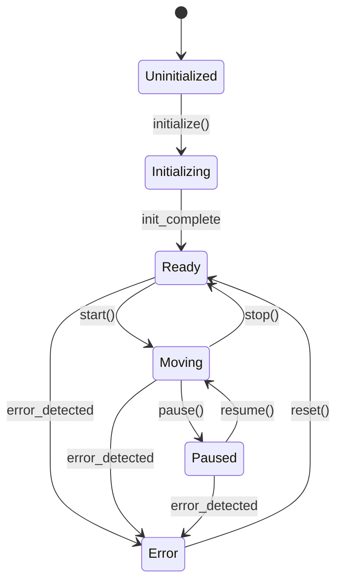
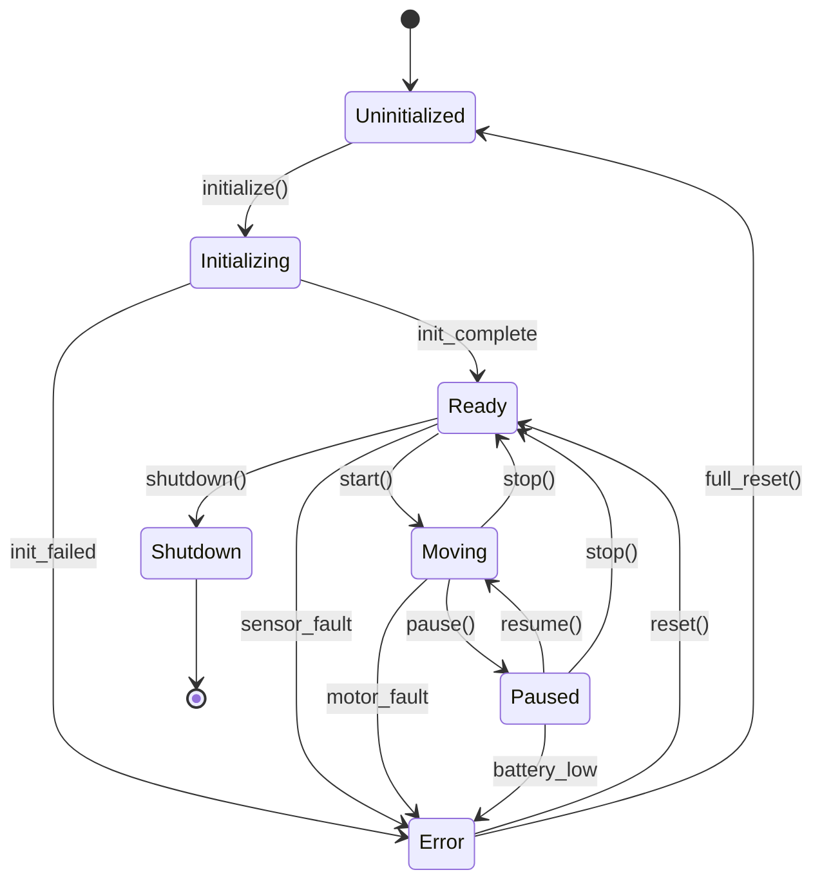

# Complete Workflow: From Code to Debuggable State Machine

This guide shows the complete workflow from analyzing existing code to having a debuggable XState implementation.

## The Complete Pipeline

```
┌────────────────────┐
│  Your Robot Code   │  (Implicit state machine)
└──────────┬─────────┘
           │
           │ Step 1: Extract
           ▼
┌────────────────────┐
│  code-to-fsm       │  → Analyzes code with Claude
└──────────┬─────────┘  → Generates Mermaid diagram
           │
           │ Step 2: Refine (optional)
           ▼
┌────────────────────┐
│  Mermaid Diagram   │  → Edit diagram if needed
└──────────┬─────────┘  → Add missing transitions
           │
           │ Step 3: Convert
           ▼
┌────────────────────┐
│ mermaid-to-xstate  │  → Converts to XState
└──────────┬─────────┘  → Generates executable code
           │
           │ Step 4: Refactor
           ▼
┌────────────────────┐
│  Your New Code     │  (Explicit XState machine)
└──────────┬─────────┘
           │
           │ Step 5: Debug
           ▼
┌────────────────────┐
│  XState Inspector  │  → Visual debugging
└────────────────────┘  → Time-travel debugging
```

## Step-by-Step Example

### Starting Point: Implicit State Machine

```python
# robot_controller.py - Before
class Robot:
    def __init__(self):
        self.is_moving = False
        self.is_paused = False
        self.has_error = False
        self.is_initialized = False
    
    def update(self):
        if not self.is_initialized:
            self.initialize()
        elif self.has_error:
            self.handle_error()
        elif self.is_paused:
            # Do nothing
            pass
        elif self.is_moving:
            self.move()
        # ... messy state logic
```

**Problems:**
- State scattered across multiple boolean flags
- Hard to visualize all possible states
- Easy to miss edge cases
- Difficult to debug
- No clear state transition rules

### Step 1: Extract State Machine

```bash
cd code-to-fsm
node cli.js analyze ../my-robot --to-xstate -o ../output
```

**Output:** `state-machine.mmd`


### Step 2: Review & Refine

Open `state-machine.mmd` and refine if needed:



### Step 3: Convert to XState

```bash
cd ../mermaid-to-xstate
node cli.js ../output/state-machine.mmd -o ../output/robot-machine.js -i robotMachine
```

**Output:** `robot-machine.js`
```javascript
import { createMachine } from 'xstate';

const machine = createMachine({
  id: "robotMachine",
  initial: "Uninitialized",
  states: {
    Uninitialized: {
      on: { INITIALIZE: "Initializing" }
    },
    Initializing: {
      on: {
        INIT_COMPLETE: "Ready",
        INIT_FAILED: "Error"
      }
    },
    Ready: {
      on: {
        START: "Moving",
        SENSOR_FAULT: "Error",
        SHUTDOWN: "Shutdown"
      }
    },
    Moving: {
      on: {
        PAUSE: "Paused",
        STOP: "Ready",
        MOTOR_FAULT: "Error"
      }
    },
    Paused: {
      on: {
        RESUME: "Moving",
        STOP: "Ready",
        BATTERY_LOW: "Error"
      }
    },
    Error: {
      on: {
        RESET: "Ready",
        FULL_RESET: "Uninitialized"
      }
    },
    Shutdown: {
      type: "final"
    }
  }
});

export default machine;
```

### Step 4: Refactor Your Code

Now refactor to use the explicit state machine:

```javascript
// robot_controller.js - After
import { interpret } from 'xstate';
import robotMachine from './robot-machine.js';

class Robot {
  constructor() {
    // Create state machine service
    this.service = interpret(robotMachine)
      .onTransition((state) => {
        console.log('State:', state.value);
        this.onStateChange(state);
      })
      .start();
  }
  
  // Commands now just send events
  initialize() {
    this.service.send('INITIALIZE');
  }
  
  start() {
    this.service.send('START');
  }
  
  pause() {
    this.service.send('PAUSE');
  }
  
  // State machine handles all logic
  onStateChange(state) {
    switch (state.value) {
      case 'Moving':
        this.actuallyMove();
        break;
      case 'Error':
        this.handleErrorState();
        break;
      // ...
    }
  }
  
  // Check state instead of flags
  isReady() {
    return this.service.state.matches('Ready');
  }
  
  canMove() {
    return this.service.state.can('START');
  }
}
```

**Benefits:**
- ✅ Clear, explicit state
- ✅ Impossible to be in invalid state
- ✅ Easy to reason about
- ✅ Can check `state.can(event)` before sending
- ✅ Built-in debugging support

### Step 5: Add Guards and Actions

Enhance the machine with guards (conditions) and actions (side effects):

```javascript
import { createMachine, assign } from 'xstate';

const robotMachine = createMachine({
  id: "robotMachine",
  initial: "Uninitialized",
  context: {
    position: { x: 0, y: 0 },
    battery: 100,
    errorMessage: null
  },
  states: {
    Ready: {
      entry: 'clearError',  // Action: clear error on entry
      on: {
        START: {
          target: 'Moving',
          guard: 'hasSufficientBattery',  // Guard: only if battery > 20%
          actions: 'logStart'
        },
        SENSOR_FAULT: {
          target: 'Error',
          actions: assign({
            errorMessage: 'Sensor malfunction detected'
          })
        }
      }
    },
    Moving: {
      entry: 'startMotors',
      exit: 'stopMotors',
      on: {
        PAUSE: 'Paused',
        MOTOR_FAULT: {
          target: 'Error',
          actions: assign({
            errorMessage: 'Motor fault detected'
          })
        }
      }
    },
    // ... other states
  }
}, {
  guards: {
    hasSufficientBattery: (context) => context.battery > 20
  },
  actions: {
    clearError: assign({ errorMessage: null }),
    logStart: () => console.log('Starting movement'),
    startMotors: () => console.log('Motors ON'),
    stopMotors: () => console.log('Motors OFF')
  }
});
```

### Step 6: Debug with XState Inspector

Install the inspector:
```bash
npm install @xstate/inspect
```

Add to your code:
```javascript
import { inspect } from '@xstate/inspect';

// Start inspector (dev only)
if (process.env.NODE_ENV !== 'production') {
  inspect({
    iframe: false  // Open in separate window
  });
}

// Create service with inspector
const service = interpret(robotMachine, { devTools: true });
```

Visit https://stately.ai/viz to see:
- Current state in real-time
- Available transitions
- State history (time-travel!)
- Context values
- Event logs

## Comparison: Before vs After

### Before (Implicit State)
```python
# Scattered flags
is_moving = True
is_paused = False
has_error = False

# Unclear transitions
if user_clicks_pause:
    if is_moving and not has_error:
        is_paused = True
        is_moving = False

# What if both flags are True? 🤔
```

### After (Explicit State Machine)
```javascript
// Single source of truth
state.value  // "Moving" | "Paused" | "Error" | ...

// Clear transitions
service.send('PAUSE');

// Impossible to have invalid state! ✅
```

## Common Patterns

### Pattern 1: Error Recovery
```javascript
states: {
  Error: {
    on: {
      RETRY: [
        { target: 'Initializing', guard: 'isInitError' },
        { target: 'Ready', guard: 'isRuntimeError' }
      ]
    }
  }
}
```

### Pattern 2: Timeout Transitions
```javascript
states: {
  Initializing: {
    after: {
      5000: { target: 'Error', actions: 'logTimeout' }
    }
  }
}
```

### Pattern 3: Nested States
```javascript
states: {
  Operating: {
    initial: 'Idle',
    states: {
      Idle: { on: { START: 'Active' } },
      Active: { on: { STOP: 'Idle' } }
    },
    on: {
      EMERGENCY_STOP: '#robotMachine.Error'
    }
  }
}
```

## Tips & Best Practices

1. **Start Simple**: Extract basic states first, add guards/actions later
2. **Name Events Clearly**: Use UPPER_CASE for events, PascalCase for states
3. **One Machine Per Component**: Don't create a god-machine for everything
4. **Test State Transitions**: Write tests for invalid transitions
5. **Use the Inspector**: Debug visually, it's much easier than console.log

## Troubleshooting

**Q: Claude extracted too many states**
A: Use `--focus` flag to narrow the scope, or manually simplify the Mermaid diagram

**Q: My code doesn't have clear states**
A: That's exactly why you need this! The process of extracting the FSM will help you discover the implicit state machine and refactor it to be explicit.

**Q: Can I use this with existing XState code?**
A: Yes! Use `code-to-fsm` to document existing machines or compare them with your mental model.

## Next Steps

1. Try it on your robot project: `node cli.js analyze /path/to/project`
2. Review the generated diagram
3. Refactor incrementally - start with one component
4. Add guards and actions as needed
5. Use XState Inspector to debug
6. Enjoy clearer, more maintainable code! 🎉

---

For more info:
- XState docs: https://xstate.js.org
- Mermaid docs: https://mermaid.js.org
- Stately Inspector: https://stately.ai/viz
