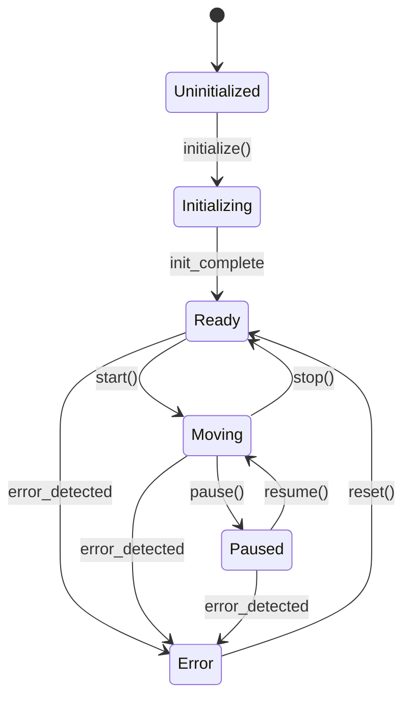
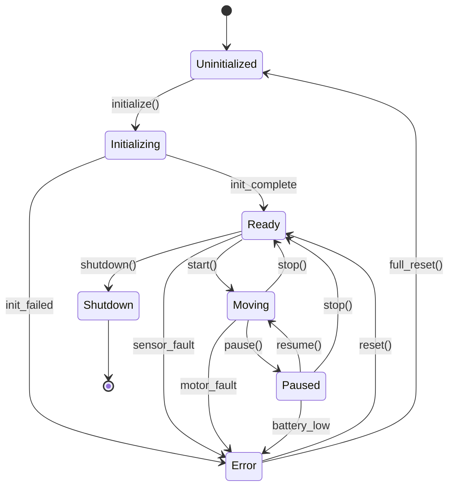
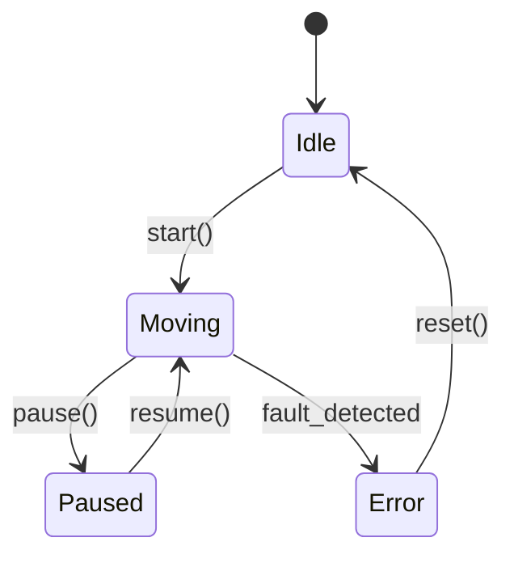
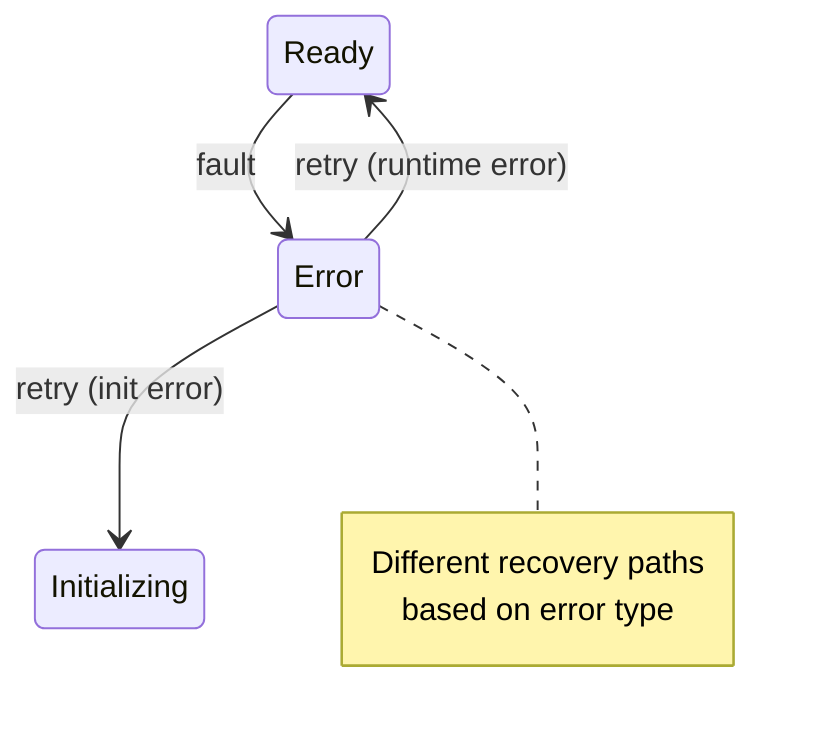
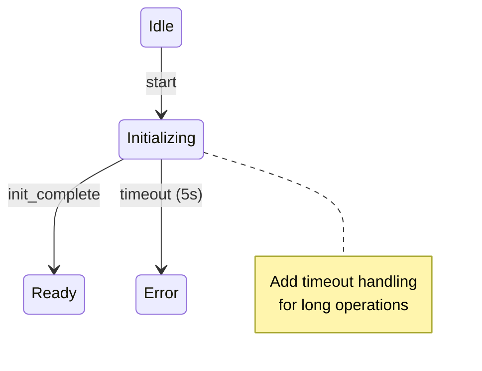
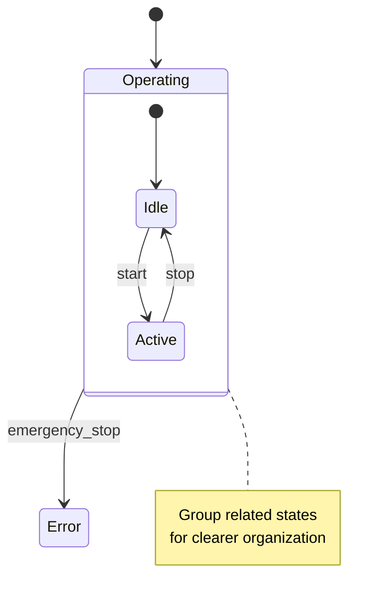

# Complete Workflow: From Code to Visual State Diagrams

This guide shows the complete workflow from analyzing existing code to generating beautiful, shareable Mermaid diagrams.

## The Complete Pipeline

```
┌────────────────────┐
│  Your Robot Code   │  (Implicit state machine)
└──────────┬─────────┘
           │
           │ Step 1: Extract
           ▼
┌────────────────────┐
│  code-to-fsm       │  → Analyzes code with Claude
└──────────┬─────────┘  → Generates Mermaid diagram
           │
           │ Step 2: Visualize
           ▼
┌────────────────────┐
│  Browser Viewer    │  → Interactive visualization
└──────────┬─────────┘  → Zoom, pan, export
           │
           │ Step 3: Refine (optional)
           ▼
┌────────────────────┐
│  Mermaid Diagram   │  → Edit diagram if needed
└──────────┬─────────┘  → Add missing transitions
           │
           │ Step 4: Document & Share
           ▼
┌────────────────────┐
│  Documentation     │  → Add to docs
└────────────────────┘  → Share with team
```

## Step-by-Step Example

### Starting Point: Implicit State Machine

```python
# robot_controller.py - Before
class Robot:
    def __init__(self):
        self.is_moving = False
        self.is_paused = False
        self.has_error = False
        self.is_initialized = False
    
    def update(self):
        if not self.is_initialized:
            self.initialize()
        elif self.has_error:
            self.handle_error()
        elif self.is_paused:
            # Do nothing
            pass
        elif self.is_moving:
            self.move()
        # ... messy state logic
```

**Problems:**
- State scattered across multiple boolean flags
- Hard to visualize all possible states
- Easy to miss edge cases
- Difficult to debug
- No clear state transition rules

### Step 1: Extract State Machine

```bash
cd code-to-fsm
python3 cli.py analyze ../my-robot -o ../output
```

**Output:** `state-machine.mmd`


### Step 2: Review & Refine

Open `state-machine.mmd` and refine if needed:



### Step 3: View in Browser

The analyzer automatically opens an interactive HTML visualization in your browser featuring:
- **Zoom and Pan**: Navigate large diagrams easily
- **Export Options**: Save as SVG or PNG
- **Clean Rendering**: Professional Mermaid visualization
- **Shareable**: Send link or screenshot to team members

You can also manually view it anytime:
```bash
# Open the generated HTML file
open ../output/state-machine.html  # macOS
start ../output/state-machine.html # Windows
xdg-open ../output/state-machine.html # Linux
```

### Step 4: Use for Documentation & Planning

Now you can use the diagram for multiple purposes:

**For Documentation:**
```bash
# Copy to docs folder
cp ../output/state-machine.mmd ../docs/architecture/

# Or export as image from browser
# Click "Export" → "PNG" or "SVG"
```

**For Team Communication:**
- Share the diagram in design reviews
- Use in technical specifications
- Include in pull request descriptions
- Add to project wiki

**For Refactoring Planning:**
- Identify complex state transitions that need simplification
- Find missing error handling paths
- Discover unreachable states
- Plan incremental refactoring steps

**Benefits:**
- ✅ Clear visualization of implicit state logic
- ✅ Easy to spot issues and edge cases
- ✅ Great for team alignment
- ✅ Perfect for onboarding new developers
- ✅ Living documentation that stays in sync

### Step 5: Iterate and Improve

Use the visual diagram to guide improvements:

**Identify Issues:**
```bash
# Run interactive mode to explore specific areas
cd code-to-fsm
python3 cli.py interactive ../my-robot
```

Ask Claude questions like:
- "What happens if we're in Moving state and get a battery error?"
- "Are there any unreachable states?"
- "Can we simplify these transitions?"

**Refine the Diagram:**
1. Edit the `.mmd` file to add missing transitions
2. Add notes about guards or conditions as comments
3. Simplify complex state structures
4. Document edge cases

**Keep it Updated:**
```bash
# Re-run analysis after code changes
python3 cli.py analyze ../my-robot -o ../output

# Compare with previous version
diff ../output/state-machine.mmd ../docs/previous-version.mmd
```

## Comparison: Before vs After

### Before (Implicit State)
```python
# Scattered flags - hard to understand
is_moving = True
is_paused = False
has_error = False

# Unclear transitions - bugs waiting to happen
if user_clicks_pause:
    if is_moving and not has_error:
        is_paused = True
        is_moving = False

# What if both flags are True? 🤔
# How do we transition from error to moving?
# No documentation of valid states!
```

### After (Visual State Diagram)


**Benefits:**
- ✅ All states visible at a glance
- ✅ All transitions documented
- ✅ Easy to spot missing error handling
- ✅ Clear communication with team
- ✅ Foundation for refactoring

## Common Diagram Patterns

### Pattern 1: Error Recovery


### Pattern 2: Timeout Transitions


### Pattern 3: Nested States (Hierarchical)


## Tips & Best Practices

1. **Start Simple**: Extract basic states first, refine later
2. **Name States Clearly**: Use descriptive names that match your domain
3. **Document Transitions**: Add notes in Mermaid for complex transition logic
4. **Use Interactive Mode**: Chat with Claude to understand unclear state logic
5. **Keep Diagrams Updated**: Re-run analysis after significant code changes
6. **Export and Share**: Use PNG/SVG exports for documentation and presentations

## Troubleshooting

**Q: Claude extracted too many states**
A: Use `--focus` flag to narrow the scope, or manually simplify the Mermaid diagram

**Q: My code doesn't have clear states**
A: That's exactly why you need this! The process of extracting the FSM will help you discover the implicit state machine and make it visible.

**Q: The diagram is too complex**
A: This often reveals that the code itself is too complex. Use the diagram to identify refactoring opportunities.

**Q: Some transitions are missing**
A: Edit the `.mmd` file to add them, or use interactive mode to ask Claude about specific scenarios.

## Next Steps

1. Try it on your project: `python3 cli.py analyze /path/to/project`
2. Review the generated diagram in your browser
3. Export diagrams for documentation
4. Share with your team for feedback
5. Use insights to plan refactoring
6. Keep diagrams updated as code evolves
7. Enjoy clearer, better-documented code! 🎉

---

For more info:
- Mermaid docs: https://mermaid.js.org
- Mermaid Live Editor: https://mermaid.live
- State Machine Concepts: https://en.wikipedia.org/wiki/Finite-state_machine
