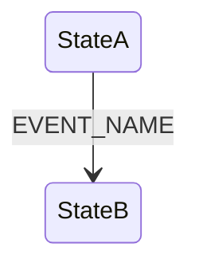
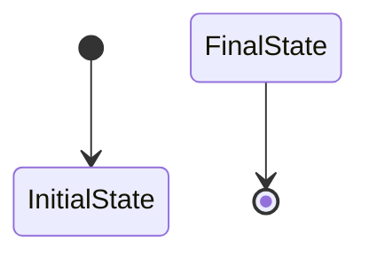
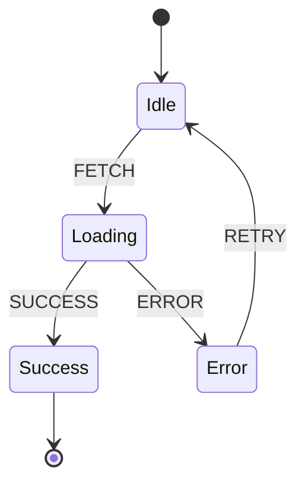

# Mermaid to XState Converter

Convert Mermaid state diagrams to XState machine definitions.

## Installation

```bash
npm install
npm link  # Optional: to use globally as `mermaid-to-xstate` command
```

## Usage

### Basic Usage

```bash
node cli.js input.mmd
```

This will output the XState machine code to stdout.

### Save to File

```bash
node cli.js input.mmd -o output.js
```

### Options

- `-o, --output <file>` - Output file (default: stdout)
- `-f, --format <format>` - Output format: `esm` (default), `cjs`, or `json`
- `-i, --id <id>` - Machine ID (default: `generatedMachine`)

### Examples

**ESM format (default):**
```bash
node cli.js example.mmd -o machine.js -f esm -i myMachine
```

**CommonJS format:**
```bash
node cli.js example.mmd -o machine.js -f cjs -i myMachine
```

**JSON format:**
```bash
node cli.js example.mmd -o machine.json -f json -i myMachine
```

## Supported Mermaid Syntax

### Basic State Transitions



### Initial and Final States



### Complete Example



This converts to:

```javascript
import { createMachine } from 'xstate';

const machine = createMachine({
  "id": "generatedMachine",
  "initial": "Idle",
  "states": {
    "Idle": {
      "on": {
        "FETCH": "Loading"
      }
    },
    "Loading": {
      "on": {
        "SUCCESS": "Success",
        "ERROR": "Error"
      }
    },
    "Success": {
      "type": "final"
    },
    "Error": {
      "on": {
        "RETRY": "Idle"
      }
    }
  }
});

export default machine;
```

## Using with XState

After generating your machine:

1. Install XState: `npm install xstate`
2. Import and use your machine:

```javascript
import { interpret } from 'xstate';
import machine from './output.js';

// Create a service
const service = interpret(machine)
  .onTransition((state) => {
    console.log('Current state:', state.value);
  })
  .start();

// Send events
service.send('FETCH');
service.send('SUCCESS');
```

## Using with XState Inspector

For visual debugging:

```javascript
import { inspect } from '@xstate/inspect';
import { interpret } from 'xstate';
import machine from './output.js';

// Start inspector
inspect({
  iframe: false
});

// Create service with inspector
const service = interpret(machine, {
  devTools: true
}).start();
```

Then open https://stately.ai/viz to visualize and debug your state machine in real-time.

## Current Limitations

- Does not parse nested/hierarchical states
- Does not parse parallel states
- Does not parse guards, actions, or context
- Event-less transitions are converted to `always` transitions

## Future Enhancements

Potential additions:
- Support for guards using Mermaid notes/annotations
- Support for actions
- Support for context/extended state
- Support for nested states
- Support for parallel states
- Interactive mode for adding guards/actions
- Validation and error reporting

## License

MIT
